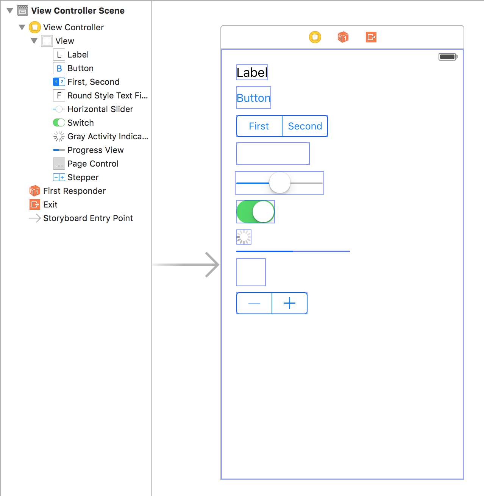

# UIKit

  

> Rrrrrrr-ghghghghgh! ~[Chewbacca](https://en.wikipedia.org/wiki/Chewbacca)

## Learning Objectives - The student should be able to...

* See Outline
* Need to fill this out

## What the student can do at this point 

* Has a general overview of Xcode and is able to create a new project.
* Knows where to locate the testing file within Xcode.
* Knows how to navigate to Interface Builder.
* Knows what a storyboard file is.
* Has a brief overview of what the Object Library is.
* Can drag a View Controller onto the canvas.
* Can locate and drag items from the Object Library.
* Can locate the Attributes Inspector and change the Background color of Views
* They know how to connect the ViewController.swift file and understand it's view life cycle.
* Can hook up IBOutlets and IBActions.

## Outline / Notes

* My thoughts for this particular lesson
* Show them something like this:  
 

* Potential idea for this reading. We just have them drag/drop these various UI Objects onto this screen.  
* After doing that, do have 1 question per UI object that requires them to find the answer in the documentation?  
* Another idea, is just providing links to the documentation about these various UI objects that has them read the various properties/methods associated with each one.  
* Complete reversal on what I'm thinking above. Maybe we just introduce some of these objects, but do so in a way that allows them to nest views and then in `viewDidLoad()` have them hide some of these container views so that way they see every view within it hide as well?  
* This particular reading has a pretty open outline, I'm willing to speak on any ideas or directions we could take this.

<a href='https://learn.co/lessons/uiElements' data-visibility='hidden'>View this lesson on Learn.co</a>